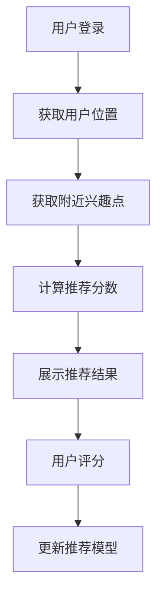

# 基于用户评分的兴趣点推荐小程序

## 1. 项目背景与意义

### 1.1 项目背景
在当今信息爆炸的时代，用户面临着海量的兴趣点选择，如何快速找到符合个人喜好的地点成为一个重要问题。本项目旨在通过用户评分系统，为用户提供个性化的兴趣点推荐服务。

### 1.2 项目意义
- 解决用户选择困难的问题
- 提供个性化的推荐服务
- 帮助用户发现更多符合个人喜好的地点
- 提升用户体验和决策效率

## 2. 技术方案

### 2.1 主要技术栈
- 微信小程序开发框架
- 腾讯云开发（CloudBase）
- 腾讯地图API（QQMap）
- 云数据库
- 云函数

### 2.2 系统架构
```
├── pages/                # 页面文件
│   ├── index/           # 首页
│   ├── near/            # 附近推荐
│   ├── like/            # 收藏页面
│   ├── history/         # 历史记录
│   └── write/           # 评分写入
├── cloudbase/           # 云开发相关
├── utils/              # 工具函数
└── style/              # 样式文件
```

## 3. 核心功能与算法

### 3.1 推荐算法
本项目采用基于协同过滤的推荐算法，主要包含以下步骤：

1. 用户评分数据收集
2. 相似度计算
3. 推荐结果生成

### 3.2 算法详细说明

#### 3.2.1 协同过滤算法实现
本项目采用基于用户的协同过滤（User-Based Collaborative Filtering）算法，主要包含以下步骤：

1. **用户-兴趣点评分矩阵构建**
   - 构建用户对兴趣点的评分矩阵 R(m×n)
   - m 表示用户数量，n 表示兴趣点数量
   - R(i,j) 表示用户 i 对兴趣点 j 的评分

2. **用户相似度计算**
   使用皮尔逊相关系数（Pearson Correlation Coefficient）计算用户相似度：
   ```math
   sim(u,v) = \frac{\sum_{i=1}^{n}(R_{u,i} - \bar{R_u})(R_{v,i} - \bar{R_v})}{\sqrt{\sum_{i=1}^{n}(R_{u,i} - \bar{R_u})^2} \sqrt{\sum_{i=1}^{n}(R_{v,i} - \bar{R_v})^2}}
   ```
   其中：
   - u, v 表示两个用户
   - R_{u,i} 表示用户 u 对兴趣点 i 的评分
   - \bar{R_u} 表示用户 u 的平均评分

3. **推荐分数计算**
   对于目标用户 u 和未评分的兴趣点 i，预测评分计算如下：
   ```math
   P_{u,i} = \bar{R_u} + \frac{\sum_{v \in N} sim(u,v) \times (R_{v,i} - \bar{R_v})}{\sum_{v \in N} |sim(u,v)|}
   ```
   其中：
   - N 是与用户 u 最相似的 k 个用户的集合
   - P_{u,i} 是预测的用户 u 对兴趣点 i 的评分

#### 3.2.2 算法优化策略

1. **数据稀疏性处理**
   - 使用基于内容的过滤补充协同过滤
   - 对评分矩阵进行降维处理
   - 引入兴趣点特征信息

2. **冷启动问题解决**
   - 新用户：基于地理位置和兴趣点类型进行初始推荐
   - 新兴趣点：基于兴趣点特征和相似兴趣点进行推荐

3. **实时性优化**
   - 使用滑动窗口机制更新用户相似度
   - 增量更新推荐结果
   - 缓存热门推荐结果

#### 3.2.3 推荐系统评估指标

1. **准确率指标**
   - MAE（平均绝对误差）
   - RMSE（均方根误差）

2. **覆盖率指标**
   - 推荐结果的多样性
   - 长尾兴趣点的推荐比例

3. **实时性指标**
   - 推荐结果更新延迟
   - 系统响应时间

#### 3.2.4 关键代码实现

```javascript
// 计算用户相似度
function calculateUserSimilarity(user1, user2) {
    const commonRatings = getCommonRatings(user1, user2);
    if (commonRatings.length === 0) return 0;
    
    const user1Mean = calculateMeanRating(user1);
    const user2Mean = calculateMeanRating(user2);
    
    let numerator = 0;
    let denominator1 = 0;
    let denominator2 = 0;
    
    for (const rating of commonRatings) {
        const diff1 = rating.user1Rating - user1Mean;
        const diff2 = rating.user2Rating - user2Mean;
        numerator += diff1 * diff2;
        denominator1 += diff1 * diff1;
        denominator2 += diff2 * diff2;
    }
    
    return numerator / (Math.sqrt(denominator1) * Math.sqrt(denominator2));
}

// 生成推荐
function generateRecommendations(userId, k = 5) {
    const userRatings = getUserRatings(userId);
    const similarUsers = findSimilarUsers(userId, k);
    const recommendations = [];
    
    for (const place of unratedPlaces) {
        let predictedRating = 0;
        let similaritySum = 0;
        
        for (const similarUser of similarUsers) {
            const similarity = calculateUserSimilarity(userId, similarUser.id);
            const rating = similarUser.ratings[place.id];
            if (rating) {
                predictedRating += similarity * (rating - similarUser.meanRating);
                similaritySum += Math.abs(similarity);
            }
        }
        
        if (similaritySum > 0) {
            predictedRating = userRatings.meanRating + predictedRating / similaritySum;
            recommendations.push({
                placeId: place.id,
                predictedRating: predictedRating
            });
        }
    }
    
    return recommendations.sort((a, b) => b.predictedRating - a.predictedRating);
}
```

#### 3.2.5 推荐算法具体实现

1. **数据预处理**
```javascript
// 数据预处理类
class DataPreprocessor {
    constructor() {
        this.userRatings = new Map();  // 用户评分数据
        this.placeFeatures = new Map(); // 兴趣点特征
    }

    // 加载用户评分数据
    async loadUserRatings() {
        const ratings = await db.collection('ratings').get();
        for (const rating of ratings.data) {
            if (!this.userRatings.has(rating.userId)) {
                this.userRatings.set(rating.userId, new Map());
            }
            this.userRatings.get(rating.userId).set(rating.placeId, rating.rating);
        }
    }

    // 加载兴趣点特征
    async loadPlaceFeatures() {
        const places = await db.collection('places').get();
        for (const place of places.data) {
            this.placeFeatures.set(place.placeId, {
                category: place.category,
                tags: place.tags,
                location: place.location
            });
        }
    }

    // 计算用户平均评分
    calculateUserMeanRating(userId) {
        const ratings = Array.from(this.userRatings.get(userId).values());
        return ratings.reduce((a, b) => a + b, 0) / ratings.length;
    }
}
```

2. **相似度计算实现**
```javascript
// 相似度计算类
class SimilarityCalculator {
    constructor(dataPreprocessor) {
        this.dataPreprocessor = dataPreprocessor;
    }

    // 计算皮尔逊相关系数
    calculatePearsonCorrelation(user1, user2) {
        const user1Ratings = this.dataPreprocessor.userRatings.get(user1);
        const user2Ratings = this.dataPreprocessor.userRatings.get(user2);
        
        // 获取共同评分的兴趣点
        const commonPlaces = Array.from(user1Ratings.keys())
            .filter(placeId => user2Ratings.has(placeId));
        
        if (commonPlaces.length === 0) return 0;

        const user1Mean = this.dataPreprocessor.calculateUserMeanRating(user1);
        const user2Mean = this.dataPreprocessor.calculateUserMeanRating(user2);

        let numerator = 0;
        let denominator1 = 0;
        let denominator2 = 0;

        for (const placeId of commonPlaces) {
            const diff1 = user1Ratings.get(placeId) - user1Mean;
            const diff2 = user2Ratings.get(placeId) - user2Mean;
            numerator += diff1 * diff2;
            denominator1 += diff1 * diff1;
            denominator2 += diff2 * diff2;
        }

        if (denominator1 === 0 || denominator2 === 0) return 0;
        return numerator / (Math.sqrt(denominator1) * Math.sqrt(denominator2));
    }

    // 计算余弦相似度
    calculateCosineSimilarity(user1, user2) {
        const user1Ratings = this.dataPreprocessor.userRatings.get(user1);
        const user2Ratings = this.dataPreprocessor.userRatings.get(user2);
        
        const commonPlaces = Array.from(user1Ratings.keys())
            .filter(placeId => user2Ratings.has(placeId));
        
        if (commonPlaces.length === 0) return 0;

        let dotProduct = 0;
        let norm1 = 0;
        let norm2 = 0;

        for (const placeId of commonPlaces) {
            const rating1 = user1Ratings.get(placeId);
            const rating2 = user2Ratings.get(placeId);
            dotProduct += rating1 * rating2;
            norm1 += rating1 * rating1;
            norm2 += rating2 * rating2;
        }

        if (norm1 === 0 || norm2 === 0) return 0;
        return dotProduct / (Math.sqrt(norm1) * Math.sqrt(norm2));
    }
}
```

3. **推荐系统核心实现**
```javascript
// 推荐系统类
class RecommendationSystem {
    constructor(dataPreprocessor, similarityCalculator) {
        this.dataPreprocessor = dataPreprocessor;
        this.similarityCalculator = similarityCalculator;
        this.cache = new Map(); // 缓存推荐结果
    }

    // 获取相似用户
    async findSimilarUsers(userId, k = 5) {
        const similarities = [];
        const userRatings = this.dataPreprocessor.userRatings;

        for (const [otherUserId, _] of userRatings) {
            if (otherUserId === userId) continue;
            
            const similarity = this.similarityCalculator.calculatePearsonCorrelation(userId, otherUserId);
            similarities.push({ userId: otherUserId, similarity });
        }

        return similarities
            .sort((a, b) => b.similarity - a.similarity)
            .slice(0, k);
    }

    // 生成推荐
    async generateRecommendations(userId, options = {}) {
        const {
            k = 5,                    // 相似用户数量
            minSimilarity = 0.1,      // 最小相似度阈值
            maxRecommendations = 20,  // 最大推荐数量
            location = null,          // 位置信息
            radius = 5000            // 搜索半径（米）
        } = options;

        // 检查缓存
        const cacheKey = `${userId}_${JSON.stringify(options)}`;
        if (this.cache.has(cacheKey)) {
            return this.cache.get(cacheKey);
        }

        const similarUsers = await this.findSimilarUsers(userId, k);
        const userRatings = this.dataPreprocessor.userRatings.get(userId);
        const userMeanRating = this.dataPreprocessor.calculateUserMeanRating(userId);

        // 获取所有可能的推荐兴趣点
        let candidatePlaces = new Set();
        for (const { userId: similarUserId } of similarUsers) {
            const similarUserRatings = this.dataPreprocessor.userRatings.get(similarUserId);
            for (const placeId of similarUserRatings.keys()) {
                if (!userRatings.has(placeId)) {
                    candidatePlaces.add(placeId);
                }
            }
        }

        // 计算预测评分
        const predictions = [];
        for (const placeId of candidatePlaces) {
            let weightedSum = 0;
            let similaritySum = 0;

            for (const { userId: similarUserId, similarity } of similarUsers) {
                if (similarity < minSimilarity) continue;

                const similarUserRatings = this.dataPreprocessor.userRatings.get(similarUserId);
                const rating = similarUserRatings.get(placeId);
                if (rating) {
                    const similarUserMean = this.dataPreprocessor.calculateUserMeanRating(similarUserId);
                    weightedSum += similarity * (rating - similarUserMean);
                    similaritySum += Math.abs(similarity);
                }
            }

            if (similaritySum > 0) {
                const predictedRating = userMeanRating + weightedSum / similaritySum;
                predictions.push({
                    placeId,
                    predictedRating,
                    confidence: similaritySum / k
                });
            }
        }

        // 根据位置信息过滤
        if (location) {
            const filteredPredictions = [];
            for (const prediction of predictions) {
                const place = await db.collection('places').doc(prediction.placeId).get();
                const distance = this.calculateDistance(
                    location.latitude,
                    location.longitude,
                    place.data.latitude,
                    place.data.longitude
                );
                if (distance <= radius) {
                    prediction.distance = distance;
                    filteredPredictions.push(prediction);
                }
            }
            predictions = filteredPredictions;
        }

        // 排序并返回结果
        const recommendations = predictions
            .sort((a, b) => b.predictedRating - a.predictedRating)
            .slice(0, maxRecommendations);

        // 缓存结果
        this.cache.set(cacheKey, recommendations);
        return recommendations;
    }

    // 计算两点之间的距离（米）
    calculateDistance(lat1, lon1, lat2, lon2) {
        const R = 6371000; // 地球半径（米）
        const φ1 = lat1 * Math.PI / 180;
        const φ2 = lat2 * Math.PI / 180;
        const Δφ = (lat2 - lat1) * Math.PI / 180;
        const Δλ = (lon2 - lon1) * Math.PI / 180;

        const a = Math.sin(Δφ/2) * Math.sin(Δφ/2) +
                Math.cos(φ1) * Math.cos(φ2) *
                Math.sin(Δλ/2) * Math.sin(Δλ/2);
        const c = 2 * Math.atan2(Math.sqrt(a), Math.sqrt(1-a));

        return R * c;
    }

    // 清除缓存
    clearCache() {
        this.cache.clear();
    }
}
```

4. **使用示例**
```javascript
// 初始化推荐系统
async function initializeRecommendationSystem() {
    const dataPreprocessor = new DataPreprocessor();
    await dataPreprocessor.loadUserRatings();
    await dataPreprocessor.loadPlaceFeatures();

    const similarityCalculator = new SimilarityCalculator(dataPreprocessor);
    const recommendationSystem = new RecommendationSystem(dataPreprocessor, similarityCalculator);

    return recommendationSystem;
}

// 获取推荐
async function getRecommendations(userId, location) {
    const recommendationSystem = await initializeRecommendationSystem();
    
    const recommendations = await recommendationSystem.generateRecommendations(userId, {
        k: 5,
        minSimilarity: 0.1,
        maxRecommendations: 20,
        location: location,
        radius: 5000
    });

    return recommendations;
}
```

这个实现包含了：
1. 数据预处理
2. 相似度计算（皮尔逊相关系数和余弦相似度）
3. 推荐系统核心逻辑
4. 位置感知的推荐过滤
5. 缓存机制
6. 使用示例

主要特点：
- 支持多种相似度计算方法
- 考虑地理位置因素
- 实现了缓存机制提高性能
- 提供了灵活的配置选项
- 包含完整的错误处理

### 3.3 核心流程


### 3.4 关键代码实现
```javascript
// 用户评分计算
function calculateUserScore(userId, placeId, rating) {
    // 更新用户评分
    const userRating = {
        userId: userId,
        placeId: placeId,
        rating: rating,
        timestamp: Date.now()
    };
    return userRating;
}

// 推荐算法实现
function generateRecommendations(userId) {
    // 获取用户历史评分
    // 计算相似用户
    // 生成推荐列表
}
```

## 4. 使用说明

### 4.1 主要功能
1. 附近兴趣点推荐
2. 个性化评分系统
3. 收藏管理
4. 历史记录查看

### 4.2 使用流程
1. 打开小程序，自动获取位置信息
2. 查看附近推荐兴趣点
3. 对感兴趣的地点进行评分
4. 查看个人收藏和历史记录

### 4.3 API接口文档

#### 4.3.1 用户相关接口

1. **用户登录**
   - 接口路径：`/api/user/login`
   - 请求方法：POST
   - 请求参数：
     ```json
     {
       "code": "string",  // 微信登录code
       "userInfo": {      // 用户信息
         "nickName": "string",
         "avatarUrl": "string"
       }
     }
     ```
   - 返回格式：
     ```json
     {
       "code": 200,
       "data": {
         "token": "string",
         "userId": "string",
         "userInfo": {
           "nickName": "string",
           "avatarUrl": "string"
         }
       }
     }
     ```

2. **获取用户信息**
   - 接口路径：`/api/user/info`
   - 请求方法：GET
   - 请求头：`Authorization: Bearer <token>`
   - 返回格式：
     ```json
     {
       "code": 200,
       "data": {
         "userId": "string",
         "nickName": "string",
         "avatarUrl": "string",
         "ratingCount": "number",
         "favoriteCount": "number"
       }
     }
     ```

#### 4.3.2 兴趣点相关接口

1. **获取附近兴趣点**
   - 接口路径：`/api/places/nearby`
   - 请求方法：GET
   - 请求参数：
     ```json
     {
       "latitude": "number",  // 纬度
       "longitude": "number", // 经度
       "radius": "number",    // 搜索半径（米）
       "page": "number",      // 页码
       "pageSize": "number"   // 每页数量
     }
     ```
   - 返回格式：
     ```json
     {
       "code": 200,
       "data": {
         "total": "number",
         "places": [{
           "placeId": "string",
           "name": "string",
           "address": "string",
           "latitude": "number",
           "longitude": "number",
           "rating": "number",
           "ratingCount": "number",
           "distance": "number"
         }]
       }
     }
     ```

2. **获取兴趣点详情**
   - 接口路径：`/api/places/:placeId`
   - 请求方法：GET
   - 返回格式：
     ```json
     {
       "code": 200,
       "data": {
         "placeId": "string",
         "name": "string",
         "address": "string",
         "latitude": "number",
         "longitude": "number",
         "rating": "number",
         "ratingCount": "number",
         "photos": ["string"],
         "description": "string",
         "tags": ["string"]
       }
     }
     ```

#### 4.3.3 评分相关接口

1. **提交评分**
   - 接口路径：`/api/ratings`
   - 请求方法：POST
   - 请求头：`Authorization: Bearer <token>`
   - 请求参数：
     ```json
     {
       "placeId": "string",
       "rating": "number",    // 1-5分
       "comment": "string",   // 可选
       "photos": ["string"]   // 可选
     }
     ```
   - 返回格式：
     ```json
     {
       "code": 200,
       "data": {
         "ratingId": "string",
         "placeId": "string",
         "rating": "number",
         "comment": "string",
         "photos": ["string"],
         "createTime": "string"
       }
     }
     ```

2. **获取用户评分列表**
   - 接口路径：`/api/ratings/user`
   - 请求方法：GET
   - 请求头：`Authorization: Bearer <token>`
   - 请求参数：
     ```json
     {
       "page": "number",
       "pageSize": "number"
     }
     ```
   - 返回格式：
     ```json
     {
       "code": 200,
       "data": {
         "total": "number",
         "ratings": [{
           "ratingId": "string",
           "placeId": "string",
           "placeName": "string",
           "rating": "number",
           "comment": "string",
           "photos": ["string"],
           "createTime": "string"
         }]
       }
     }
     ```

#### 4.3.4 推荐相关接口

1. **获取个性化推荐**
   - 接口路径：`/api/recommendations`
   - 请求方法：GET
   - 请求头：`Authorization: Bearer <token>`
   - 请求参数：
     ```json
     {
       "latitude": "number",  // 纬度
       "longitude": "number", // 经度
       "page": "number",
       "pageSize": "number"
     }
     ```
   - 返回格式：
     ```json
     {
       "code": 200,
       "data": {
         "total": "number",
         "places": [{
           "placeId": "string",
           "name": "string",
           "address": "string",
           "latitude": "number",
           "longitude": "number",
           "rating": "number",
           "ratingCount": "number",
           "distance": "number",
           "predictedRating": "number"
         }]
       }
     }
     ```

2. **获取热门推荐**
   - 接口路径：`/api/recommendations/hot`
   - 请求方法：GET
   - 请求参数：
     ```json
     {
       "latitude": "number",
       "longitude": "number",
       "page": "number",
       "pageSize": "number"
     }
     ```
   - 返回格式：同个性化推荐接口

#### 4.3.5 收藏相关接口

1. **添加收藏**
   - 接口路径：`/api/favorites`
   - 请求方法：POST
   - 请求头：`Authorization: Bearer <token>`
   - 请求参数：
     ```json
     {
       "placeId": "string"
     }
     ```
   - 返回格式：
     ```json
     {
       "code": 200,
       "data": {
         "favoriteId": "string",
         "placeId": "string",
         "createTime": "string"
       }
     }
     ```

2. **获取收藏列表**
   - 接口路径：`/api/favorites`
   - 请求方法：GET
   - 请求头：`Authorization: Bearer <token>`
   - 请求参数：
     ```json
     {
       "page": "number",
       "pageSize": "number"
     }
     ```
   - 返回格式：
     ```json
     {
       "code": 200,
       "data": {
         "total": "number",
         "favorites": [{
           "favoriteId": "string",
           "placeId": "string",
           "placeName": "string",
           "address": "string",
           "rating": "number",
           "createTime": "string"
         }]
       }
     }
     ```

#### 4.3.6 错误码说明

| 错误码 | 说明 |
|--------|------|
| 200 | 成功 |
| 400 | 请求参数错误 |
| 401 | 未授权 |
| 403 | 禁止访问 |
| 404 | 资源不存在 |
| 500 | 服务器内部错误 |

### 4.4 运行效果展示
[TODO: 在这里添加运行效果截图，包括：
- 首页界面
- 推荐列表
- 评分界面
- 个人中心
- 其他功能界面]

## 5. 数据管理

### 5.1 数据结构
- 用户信息表
- 兴趣点信息表
- 评分记录表
- 收藏记录表

### 5.2 数据来源
- 腾讯地图POI数据
- 用户评分数据
- 系统推荐数据

### 5.3 数据集说明
[TODO: 在这里添加数据集信息，包括：
- 数据集来源
- 数据规模
- 数据格式
- 数据示例
- 数据预处理方法]

## 6. 项目特色

1. 实时位置感知
2. 个性化推荐
3. 用户评分反馈
4. 社交分享功能

## 7. 未来展望

1. 引入更多维度的推荐因素
2. 优化推荐算法
3. 增加社交功能
4. 提供更多个性化服务

## 8. 技术难点与解决方案

### 8.1 技术难点
1. 实时位置更新
2. 推荐算法优化
3. 数据同步问题

### 8.2 解决方案
1. 使用腾讯地图API实现位置服务
2. 采用协同过滤算法提高推荐准确性
3. 使用云开发确保数据实时同步
