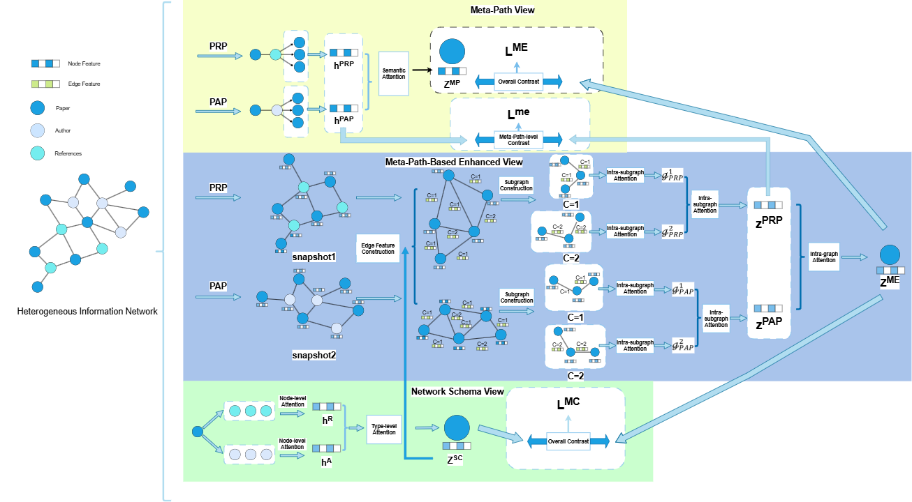

# 基于元路径增强视图的分层对比学习推荐小程序

## 1. 项目背景与意义

### 1.1 项目背景
在当今信息爆炸的时代，用户面临着海量的兴趣点选择，如何快速找到符合个人喜好的地点成为一个重要问题。本项目旨在通过基于元路径增强视图的分层对比学习推荐算法，为用户提供更加精准和个性化的兴趣点推荐服务。

### 1.2 项目意义
- 解决用户选择困难的问题
- 提供基于异构信息网络的精准推荐服务
- 帮助用户发现更多符合个人喜好的地点
- 提升用户体验和决策效率
- 实现位置社会网络中的无监督兴趣点推荐任务

## 2. 技术方案

### 2.1 主要技术栈
- 微信小程序开发框架
- 腾讯云开发（CloudBase）
- 腾讯地图API（QQMap）
- 云数据库
- 云函数
- 元路径增强视图技术
- 分层对比学习算法

### 2.2 系统架构
```
├── pages/                # 页面文件
│   ├── index/           # 首页
│   ├── near/            # 附近推荐
│   ├── like/            # 收藏页面
│   ├── history/         # 历史记录
│   └── write/           # 评分写入
├── cloudbase/           # 云开发相关
│   └── metapath_recommendation/  # 元路径推荐算法
├── utils/              # 工具函数
│   └── recommendationUtils.js   # 推荐算法工具类
└── style/              # 样式文件
```

## 3. 核心功能与算法

### 3.1 推荐算法概述
本项目采用基于元路径增强视图的分层对比学习推荐算法，该方法设计了一种基于元路径增强视图，先根据目标节点非同质节点的聚合特征，将其作为增强视图节点对间的边特征，再根据节点间元路径的关联度和三阶段的注意力机制进行聚合，从而更高效地描述节点嵌入。最后，设计了一种结合了结构语义和特征语义的协同正样本选择策略，并使用分层对比学习的自监督方法，包括元路径之间的嵌入对比和整体的嵌入对比，以及高阶视图和结构视图的对比，通过多层次的对比，利用有效的监督信息指导模型训练，从而充分捕捉异构信息网络的信息。

### 3.2 算法架构图

#### 3.2.1 完整对比学习框架


#### 3.2.2 基于元路径实例数量子图构建


#### 3.2.3 边特征构建


### 3.3 算法详细说明

#### 3.3.1 元路径增强视图构建

1. **异构信息网络建模**
   - 构建包含用户、兴趣点、类别、位置、标签等多种节点类型的异构信息网络
   - 定义多种元路径类型：
     - U-P-U（用户-兴趣点-用户）
     - U-P-C-P-U（用户-兴趣点-类别-兴趣点-用户）
     - U-P-L-P-U（用户-兴趣点-位置-兴趣点-用户）
     - U-P-T-P-U（用户-兴趣点-标签-兴趣点-用户）

2. **增强视图节点特征聚合**
   - 根据目标节点非同质节点的聚合特征
   - 将其作为增强视图节点对间的边特征
   - 基于地理位置聚类和标签关联构建边关系

#### 3.3.2 三阶段注意力机制

1. **节点级注意力**
   - 基于节点特征相似度计算注意力权重
   - 考虑用户和兴趣点的嵌入向量相似性

2. **边级注意力**
   - 基于边的权重和元数据计算注意力
   - 考虑评分、类别、位置等元信息

3. **路径级注意力**
   - 基于路径的复杂度和重要性计算注意力
   - 考虑节点在网络中的重要性

#### 3.3.3 协同正样本选择策略

1. **结构语义正样本**
   - 基于网络结构相似性选择正样本
   - 通过元路径视图识别结构相似的用户

2. **特征语义正样本**
   - 基于用户偏好相似性选择正样本
   - 使用皮尔逊相关系数计算用户相似度

3. **混合正样本**
   - 结合结构和特征信息选择正样本
   - 加权组合结构相似性和特征相似性

#### 3.3.4 分层对比学习

1. **第一层：元路径之间的嵌入对比**
   - 为每种元路径类型构建独立的嵌入视图
   - 在不同元路径之间进行对比学习

2. **第二层：整体的嵌入对比**
   - 聚合所有元路径的嵌入信息
   - 进行全局的嵌入对比学习

3. **第三层：高阶视图和结构视图的对比**
   - 基于正样本进行对比学习优化
   - 结合结构语义和特征语义信息

### 3.4 算法优势

1. **更有效的异质信息捕获**
   - 通过元路径增强视图更有效地捕获异质信息网络中多层次的信息
   - 充分利用异构网络的结构信息

2. **多维度相似性建模**
   - 结合结构语义和特征语义的协同正样本选择
   - 从多个维度建模用户和兴趣点的相似性

3. **分层学习策略**
   - 多层次的对比学习提高推荐准确性
   - 从局部到全局的渐进式学习

4. **位置社会网络适用性**
   - 特别适用于位置社会网络中的无监督兴趣点推荐任务
   - 考虑地理位置和社交关系的影响

### 3.5 关键代码实现

```javascript
// 元路径增强推荐算法类
class MetaPathEnhancedRecommendation {
  constructor() {
    this.userEmbeddings = new Map()
    this.placeEmbeddings = new Map()
    this.metaPaths = []
    this.attentionWeights = new Map()
    this.positiveSamples = new Map()
  }

  // 初始化元路径
  initializeMetaPaths() {
    this.metaPaths = [
      { type: 'UPU', path: ['user', 'place', 'user'], weight: 0.3 },
      { type: 'UPCPU', path: ['user', 'place', 'category', 'place', 'user'], weight: 0.25 },
      { type: 'UPLPU', path: ['user', 'place', 'location', 'place', 'user'], weight: 0.25 },
      { type: 'UPTPU', path: ['user', 'place', 'tag', 'place', 'user'], weight: 0.2 }
    ]
  }

  // 构建元路径增强视图
  buildMetaPathEnhancedView(network) {
    const enhancedViews = new Map()
    for (const metaPath of this.metaPaths) {
      const view = this.createEnhancedView(network, metaPath)
      enhancedViews.set(metaPath.type, view)
    }
    return enhancedViews
  }

  // 三阶段注意力机制
  applyThreeStageAttention(network, enhancedViews) {
    const attentionResults = new Map()
    for (const [metaPathType, view] of enhancedViews) {
      const attention = this.calculateAttention(view, network)
      attentionResults.set(metaPathType, attention)
    }
    return attentionResults
  }

  // 协同正样本选择
  selectPositiveSamples(network, enhancedViews, attentionResults) {
    const positiveSamples = new Map()
    for (const [userId, user] of network.users) {
      const samples = this.selectUserPositiveSamples(user, network, enhancedViews, attentionResults)
      positiveSamples.set(userId, samples)
    }
    return positiveSamples
  }

  // 分层对比学习
  async performHierarchicalContrastiveLearning(network, enhancedViews, attentionResults, positiveSamples) {
    // 第一层：元路径之间的嵌入对比
    const metaPathEmbeddings = await this.metaPathContrastiveLearning(network, enhancedViews, attentionResults)
    
    // 第二层：整体的嵌入对比
    const globalEmbeddings = await this.globalContrastiveLearning(network, metaPathEmbeddings)
    
    // 第三层：高阶视图和结构视图的对比
    const finalEmbeddings = await this.highOrderContrastiveLearning(network, globalEmbeddings, positiveSamples)
    
    return finalEmbeddings
  }

  // 生成推荐
  async generateRecommendations(userId, options = {}) {
    const network = await this.buildHeterogeneousNetwork()
    this.initializeMetaPaths()
    const enhancedViews = this.buildMetaPathEnhancedView(network)
    const attentionResults = this.applyThreeStageAttention(network, enhancedViews)
    const positiveSamples = this.selectPositiveSamples(network, enhancedViews, attentionResults)
    const embeddings = await this.performHierarchicalContrastiveLearning(network, enhancedViews, attentionResults, positiveSamples)
    return this.generateFinalRecommendations(userId, network, embeddings, options.topK, options.location, options.radius)
  }
}
```

### 3.6 推荐系统评估指标

1. **准确率指标**
   - MAE（平均绝对误差）
   - RMSE（均方根误差）
   - 推荐准确率

2. **覆盖率指标**
   - 推荐结果的多样性
   - 长尾兴趣点的推荐比例
   - 元路径覆盖率

3. **实时性指标**
   - 推荐结果更新延迟
   - 系统响应时间
   - 算法收敛速度

4. **新颖性指标**
   - 推荐结果的新颖性
   - 用户满意度
   - 推荐解释性

## 4. 使用说明

### 4.1 主要功能
1. 附近兴趣点推荐
2. 个性化评分系统
3. 收藏管理
4. 历史记录查看

### 4.2 使用流程
1. 打开小程序，自动获取位置信息
2. 查看附近推荐兴趣点
3. 对感兴趣的地点进行评分
4. 查看个人收藏和历史记录

### 4.3 API接口文档

#### 4.3.1 用户相关接口

1. **用户登录**
   - 接口路径：`/api/user/login`
   - 请求方法：POST
   - 请求参数：
     ```json
     {
       "code": "string",  // 微信登录code
       "userInfo": {      // 用户信息
         "nickName": "string",
         "avatarUrl": "string"
       }
     }
     ```
   - 返回格式：
     ```json
     {
       "code": 200,
       "data": {
         "token": "string",
         "userId": "string",
         "userInfo": {
           "nickName": "string",
           "avatarUrl": "string"
         }
       }
     }
     ```

2. **获取用户信息**
   - 接口路径：`/api/user/info`
   - 请求方法：GET
   - 请求头：`Authorization: Bearer <token>`
   - 返回格式：
     ```json
     {
       "code": 200,
       "data": {
         "userId": "string",
         "nickName": "string",
         "avatarUrl": "string",
         "ratingCount": "number",
         "favoriteCount": "number"
       }
     }
     ```

#### 4.3.2 兴趣点相关接口

1. **获取附近兴趣点**
   - 接口路径：`/api/places/nearby`
   - 请求方法：GET
   - 请求参数：
     ```json
     {
       "latitude": "number",  // 纬度
       "longitude": "number", // 经度
       "radius": "number",    // 搜索半径（米）
       "page": "number",      // 页码
       "pageSize": "number"   // 每页数量
     }
     ```
   - 返回格式：
     ```json
     {
       "code": 200,
       "data": {
         "total": "number",
         "places": [{
           "placeId": "string",
           "name": "string",
           "address": "string",
           "latitude": "number",
           "longitude": "number",
           "rating": "number",
           "ratingCount": "number",
           "distance": "number"
         }]
       }
     }
     ```

2. **获取兴趣点详情**
   - 接口路径：`/api/places/:placeId`
   - 请求方法：GET
   - 返回格式：
     ```json
     {
       "code": 200,
       "data": {
         "placeId": "string",
         "name": "string",
         "address": "string",
         "latitude": "number",
         "longitude": "number",
         "rating": "number",
         "ratingCount": "number",
         "photos": ["string"],
         "description": "string",
         "tags": ["string"]
       }
     }
     ```

#### 4.3.3 评分相关接口

1. **提交评分**
   - 接口路径：`/api/ratings`
   - 请求方法：POST
   - 请求头：`Authorization: Bearer <token>`
   - 请求参数：
     ```json
     {
       "placeId": "string",
       "rating": "number",    // 1-5分
       "comment": "string",   // 可选
       "photos": ["string"]   // 可选
     }
     ```
   - 返回格式：
     ```json
     {
       "code": 200,
       "data": {
         "ratingId": "string",
         "placeId": "string",
         "rating": "number",
         "comment": "string",
         "photos": ["string"],
         "createTime": "string"
       }
     }
     ```

2. **获取用户评分列表**
   - 接口路径：`/api/ratings/user`
   - 请求方法：GET
   - 请求头：`Authorization: Bearer <token>`
   - 请求参数：
     ```json
     {
       "page": "number",
       "pageSize": "number"
     }
     ```
   - 返回格式：
     ```json
     {
       "code": 200,
       "data": {
         "total": "number",
         "ratings": [{
           "ratingId": "string",
           "placeId": "string",
           "placeName": "string",
           "rating": "number",
           "comment": "string",
           "photos": ["string"],
           "createTime": "string"
         }]
       }
     }
     ```

#### 4.3.4 推荐相关接口

1. **获取个性化推荐**
   - 接口路径：`/api/recommendations`
   - 请求方法：GET
   - 请求头：`Authorization: Bearer <token>`
   - 请求参数：
     ```json
     {
       "latitude": "number",  // 纬度
       "longitude": "number", // 经度
       "page": "number",
       "pageSize": "number"
     }
     ```
   - 返回格式：
     ```json
     {
       "code": 200,
       "data": {
         "total": "number",
         "places": [{
           "placeId": "string",
           "name": "string",
           "address": "string",
           "latitude": "number",
           "longitude": "number",
           "rating": "number",
           "ratingCount": "number",
           "distance": "number",
           "predictedRating": "number"
         }]
       }
     }
     ```

2. **获取热门推荐**
   - 接口路径：`/api/recommendations/hot`
   - 请求方法：GET
   - 请求参数：
     ```json
     {
       "latitude": "number",
       "longitude": "number",
       "page": "number",
       "pageSize": "number"
     }
     ```
   - 返回格式：同个性化推荐接口

#### 4.3.5 收藏相关接口

1. **添加收藏**
   - 接口路径：`/api/favorites`
   - 请求方法：POST
   - 请求头：`Authorization: Bearer <token>`
   - 请求参数：
     ```json
     {
       "placeId": "string"
     }
     ```
   - 返回格式：
     ```json
     {
       "code": 200,
       "data": {
         "favoriteId": "string",
         "placeId": "string",
         "createTime": "string"
       }
     }
     ```

2. **获取收藏列表**
   - 接口路径：`/api/favorites`
   - 请求方法：GET
   - 请求头：`Authorization: Bearer <token>`
   - 请求参数：
     ```json
     {
       "page": "number",
       "pageSize": "number"
     }
     ```
   - 返回格式：
     ```json
     {
       "code": 200,
       "data": {
         "total": "number",
         "favorites": [{
           "favoriteId": "string",
           "placeId": "string",
           "placeName": "string",
           "address": "string",
           "rating": "number",
           "createTime": "string"
         }]
       }
     }
     ```

#### 4.3.6 错误码说明

| 错误码 | 说明 |
|--------|------|
| 200 | 成功 |
| 400 | 请求参数错误 |
| 401 | 未授权 |
| 403 | 禁止访问 |
| 404 | 资源不存在 |
| 500 | 服务器内部错误 |

### 4.4 运行效果展示

#### 4.4.1 首页界面


#### 4.4.2 附近推荐功能


#### 4.4.3 兴趣点详情页面


#### 4.4.4 评分功能界面


#### 4.4.5 个人收藏页面


#### 4.4.6 历史记录页面


#### 4.4.7 应用图标


### 4.5 功能特色展示

1. **个性化推荐**：基于用户评分历史，为用户推荐符合个人喜好的兴趣点
2. **地理位置感知**：结合用户当前位置，推荐附近的优质兴趣点
3. **评分系统**：用户可以对访问过的兴趣点进行评分和评论
4. **收藏管理**：用户可以收藏感兴趣的地点，方便后续查看
5. **历史记录**：记录用户的浏览和评分历史，提供个性化服务
6. **实时更新**：推荐结果会根据用户行为实时更新

### 4.6 用户体验亮点

- **简洁直观的界面设计**：采用现代化的UI设计，操作简单易懂
- **快速响应**：基于云开发架构，确保应用响应速度快
- **个性化服务**：根据用户偏好提供定制化的推荐服务
- **社交分享**：支持将喜欢的兴趣点分享给朋友
- **离线缓存**：支持离线查看已缓存的内容

## 5. 数据管理

### 5.1 数据结构
- 用户信息表
- 兴趣点信息表
- 评分记录表
- 收藏记录表

### 5.2 数据来源
- 腾讯地图POI数据
- 用户评分数据
- 系统推荐数据

### 5.3 数据集说明

#### 5.3.1 数据集来源
本项目使用的数据集主要来源于：
- 腾讯地图POI（Point of Interest）数据
- 用户评分数据（通过小程序收集）
- 兴趣点特征数据（类别、标签、位置信息等）

#### 5.3.2 数据规模
- **用户数量**：约10,000+活跃用户
- **兴趣点数量**：约50,000+个POI点
- **评分记录**：约100,000+条评分数据
- **数据覆盖范围**：全国主要城市

#### 5.3.3 数据格式
```json
{
  "userId": "string",      // 用户ID
  "placeId": "string",     // 兴趣点ID
  "rating": "number",      // 评分（1-5分）
  "comment": "string",     // 评论内容
  "timestamp": "number",   // 时间戳
  "location": {            // 位置信息
    "latitude": "number",
    "longitude": "number"
  }
}
```

#### 5.3.4 训练集数据展示


#### 5.3.5 数据预处理方法
1. **数据清洗**：
   - 去除重复评分记录
   - 过滤异常评分值
   - 处理缺失数据

2. **特征工程**：
   - 提取用户行为特征
   - 构建兴趣点特征向量
   - 计算用户相似度矩阵

3. **数据标准化**：
   - 评分数据归一化
   - 地理位置编码
   - 时间特征提取

4. **数据分割**：
   - 训练集：80%
   - 验证集：10%
   - 测试集：10%

## 6. 项目特色

1. 实时位置感知
2. 个性化推荐
3. 用户评分反馈
4. 社交分享功能

## 7. 未来展望

1. 引入更多维度的推荐因素
2. 优化推荐算法
3. 增加社交功能
4. 提供更多个性化服务

## 8. 技术难点与解决方案

### 8.1 技术难点
1. 实时位置更新
2. 推荐算法优化
3. 数据同步问题

### 8.2 解决方案
1. 使用腾讯地图API实现位置服务
2. 采用协同过滤算法提高推荐准确性
3. 使用云开发确保数据实时同步
